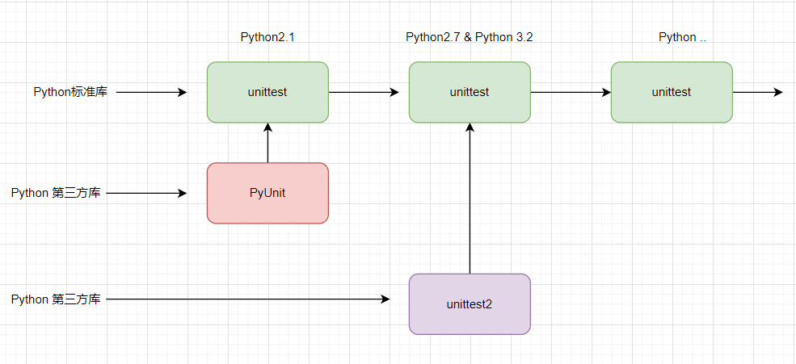

# Learn-unittest-class

📺[B站视频](https://www.bilibili.com/video/BV1JM4m167oR/?spm_id_from=333.999.0.0&vd_source=0c31d5ad24bbabdbefec07429cf847dc)，正在同步更新中~~！

## 前言

我们在学习自动化测试的时候，核心就是学习三个技术：

* 编程语言
* 单元测试框架 ⭐︎
* 测试库

`unittest` 作为Python标准库中的单元测试框架，仍然可以满足我们的绝大部分单元测试相关工作，虽然，`pytest` 正在变得更加流行。 `unittest`仍未过时，或者到了要被完全抛弃的地步，很多时候我们觉得`unittest` 不是太好用，一方面是因为对它不是足够了解，另一方面它的生态（第三方扩展插件）比较糟糕。

### unittest 优势

`unittest` 仍然是非常优秀的单元测试框架，以下是他的优势和特点。

* `标准库集成`：unittest 是 Python 标准库的一部分，安装 Python 时默认可用，不需要额外安装。

* `面向对象的设计`：通过继承 `unittest.TestCase` 组织测试代码，结构清晰，便于扩展和维护。

* `丰富的断言方法`：提供了多种断言方法，方便进行各种类型的测试检查。

本课程希望深入和全面的介绍 `unittest`的使用，以及教你如何开发 `unittest` 扩展插件，来满足单元测试/自动化测试相关工作。


* 课程大纲


## unittest历史

* unitest 发展轨迹：



### PyUnit

PyUnit是最早的Python单元测试框架，其灵感来源于JUnit（Java中的一个单元测试框架）。 由Steve Purcell开发，并成为Python社区的一个非官方标准。PyUnit 不再作为一个独立的框架存在。它的功能和设计思想已经完全融入了 unittest 模块。

### unittest

unittest是Python标准库中的单元测试框架，实际上是对PyUnit的标准化和集成。在`Python 2.1` 中首次引入，作为标准库的一部分，以后Python的每个版本都内置了unittest。 它提供了丰富的测试功能，包括测试用例（TestCase）、测试套件（TestSuite）、测试加载器（TestLoader）、测试运行器（TestRunner）和各种断言方法。

__主要变化和改进__

* 组织结构：unittest模块的结构更加清晰，便于扩展和使用。

* 改进的断言方法：unittest引入了更多的断言方法，如assertEqual、assertTrue等，方便测试编写。

* 测试发现：支持自动发现测试用例的机制，使得测试组织更加灵活。

* 测试夹具（Fixture）：支持setUp和tearDown方法，用于在测试前后进行初始化和清理工作。

### unittest2

unittest2是unittest的增强版，主要用于提供在较旧版本Python中引入的unittest功能。其目标是为还没有升级到新版本Python的用户提供最新的unittest功能。在`Python 2.7` 和`Python 3.2`中，unittest模块进行了重大改进和增强，这些改进也被包含在unittest2中。

__主要变化和改进__

* 改进的测试发现机制：更加智能和灵活的测试用例发现功能。

* 更强大的断言方法：添加了更多断言方法，比如assertIs、assertIsNone、assertIn等。

* 基于类的setUpClass和tearDownClass方法：用于在整个测试类开始前和结束后执行一些初始化和清理工作。

* 基于方法的setUpModule和tearDownModule方法：用于在整个测试模块开始前和结束后执行一些初始化和清理工作。

* 测试跳过和预期失败：引入了@unittest.skip装饰器和相关功能，用于标记跳过的测试和预期会失败的测试。

### 总结

* PyUnit 是早期的单元测试框架，启发了后来的unittest。

* unittest 是Python标准库中的单元测试框架，基于PyUnit，提供了更丰富和标准化的测试功能。

* unittest2 是unittest的增强版，主要为了提供在较旧版本Python中引入新功能的支持，但随着Python 2.7和Python
  3.2之后的版本逐渐成为主流，unittest2的使用也逐渐减少。

因此，PyUnit、unittest和unittest2基本上是同一个框架的不同演进阶段，而unittest成为了现在Python标准库中的正式单元测试框架。


## 基于unittest的库和框架

### django TestCase

Django 提供的 TestCase 类继承自 unittest.TestCase，并进行了扩展以支持 Django 应用的测试。

```python
from django.test import TestCase


class IndexPageTest(TestCase):
    """
    测试index登录首页
    """

    def test_index_page_renders_index_template(self):
        """
        断言是否用给定的index.html模版响应
        :return:
        """
        response = self.client.get('/index/')
        self.assertEqual(response.status_code, 200)
        self.assertTemplateUsed(response, 'index.html')
```

* 优势：内置对 Django ORM、视图和模板的支持，可以方便地测试 Django 应用的各个方面。

### Flask-Testing

```python
from urllib import request
from flask import Flask
from flask_testing import LiveServerTestCase


class MyTest(LiveServerTestCase):

    def create_app(self):
        app = Flask(__name__)
        app.config['TESTING'] = True
        # Default port is 5000
        app.config['LIVESERVER_PORT'] = 8943
        # Default timeout is 5 seconds
        app.config['LIVESERVER_TIMEOUT'] = 10
        return app

    def test_server_is_up_and_running(self):
        response = request.urlopen(self.get_server_url())
        self.assertEqual(response.code, 200)

```

* 优势：提供了对 Flask 应用的全面测试支持，包括视图测试和上下文管理。

### Testify

Testify 是由 Yelp 开发的一个测试框架，旨在替代 unittest，提供更强大的功能。

```python
from testify import *


class AdditionTestCase(TestCase):

    @class_setup
    def init_the_variable(self):
        self.variable = 0

    @setup
    def increment_the_variable(self):
        self.variable += 1

    def test_the_variable(self):
        assert_equal(self.variable, 1)

    @suite('disabled', reason='ticket #123, not equal to 2 places')
    def test_broken(self):
        # raises 'AssertionError: 1 !~= 1.01'
        assert_almost_equal(1, 1.01, threshold=2)

    @teardown
    def decrement_the_variable(self):
        self.variable -= 1

    @class_teardown
    def get_rid_of_the_variable(self):
        self.variable = None


if __name__ == "__main__":
    run()
```

* 优势：提供了更直观的测试 API 和强大的测试功能，如分布式测试和并行执行。

### nose2

nose2 是 nose 的继任者，旨在提供一个扩展性强、易于使用的测试框架。 nose2将unittest扩展，使测试更加方便。

```python
import unittest
from nose2.tools import params


class TestStrings(unittest.TestCase):
    def test_upper(self):
        self.assertEqual("spam".upper(), "SPAM")


@params("Sir Bedevere", "Miss Islington", "Duck")
def test_is_knight(value):
    assert value.startswith('Sir')
```

* 优势：提供了自动化发现和运行测试用例的功能，支持丰富的插件和扩展。

* 运行

```shell
> nose2 -v
```

### Seldom

seldom 是基于unittest 的自动化测试框架。

````python
import seldom


class YouTest(seldom.TestCase):

    def test_case(self):
        """a simple test case """
        self.assertEqual(1 + 1, 2)


if __name__ == '__main__':
    seldom.main()
````

* 优势：seldom是一个全功能测试框架，支持 Web/App/API测试等。

## unittest 基础

👉 [unittest — Unit testing framework](https://docs.python.org/3/library/unittest.html)

在unittest文档中有四个重要的概念： Test Case、Test Suite、Test Runner和Test Fixture。只有理解了这几个概念，才能理解单元测试的基本特征。

* Test Case

Test Case是最小的测试单元，用于检查特定输入集合的特定返回值。unittest提供了`TestCase`基类，我们创建的测试类需要继承该基类，它可以用来创建新的测试用例。

* Test Suite

测试套件是测试用例、测试套件或两者的集合，用于组装一组要运行的测试。unittest提供了`TestSuite`类来创建测试套件。

* Test Runner

Test Runner是一个组件，用于协调测试的执行并向用户提供结果。Test Runner可以使用图形界面、文本界面或返回特殊值来展示执行测试的结果。unittest提供了`TextTestRunner`类运行测试用例。

* Test Fixture

Test Fixture代表执行一个或多个测试所需的环境准备，以及关联的清理动作。例如，创建临时或代理数据库、目录，或启动服务器进程。unittest中提供了`setUp()`/`tearDown()`、`setUpClass()`/`tearDownClass()`
等方法来完成这些操作。

### 第一个测试用例

* 计算器

实现一个`Calculator` 计算器类，`add()` 方法用于参数的加法计算。

```python
# calculator.py

class Calculator:
    """
    计算器
    """

    def __init__(self, *args):
        self.args = args

    def add(self):
        """
        加法运算
        """
        return sum(self.args)
```

* 测试计算器

通过`unittest` 编写`Calculator`类的测试用例。

```python
# test_calculator.py
import unittest

from calculator import Calculator


# 1. 测试类 TestCalculator 必须继承 unittest.TestCase
class TestCalculator(unittest.TestCase):

    def setUp(self):
        """
        用例前置动作：启动浏览器、连接数据库，准备的数据 等。
        """
        print("test start")

    def tearDown(self):
        """
        用例后置动作：关闭浏览器，关闭数据库，删除/还原数据 等。
        """
        print("test end")

    # 2.测试用例必须以 test 开头
    def test_add_one(self):
        c = Calculator(2)
        result = c.add()
        self.assertEqual(result, 2)

    def test_add_two(self):
        c = Calculator(3, 5)
        result = c.add()
        self.assertEqual(result, 8)

    def test_add_three(self):
        c = Calculator(3, 5)
        result = c.add()
        self.assertEqual(result, 8)


if __name__ == '__main__':
    # 创建测试套件
    suit = unittest.TestSuite()
    suit.addTest(TestCalculator("test_add_one"))
    suit.addTest(TestCalculator("test_add_two"))
    suit.addTest(TestCalculator("test_add_three"))

    # 创建测试运行器
    runner = unittest.TextTestRunner()
    runner.run(suit)
```

* 运行测试

```bash
python test_calculator.py

test start
test end
.test start
test end
.test start
test end
.
----------------------------------------------------------------------
Ran 3 tests in 0.001s

OK
```

### 错误的用例设计

一些新人在使用 unittest 设计用例是往往会犯一些低级的错误。

❌ 错误的方法。

```py
import unittest


class TestImproperUse(unittest.TestCase):
    """
    用例错误的设计
    """

    def test_login(self, username, password):
        """
        1. 给用例加参数
        """
        print("this is login case")

    def test_case_1(self):
        print("this is test case 1")

    def test_case_2(self):
        """
        2. 在一条用例里面调用另一条用例。
        """
        self.test_case_1()
        print("this is test case 2")


if __name__ == '__main__':
    unittest.main()
```

__1. 给用例加参数。__

用例在执行的时候会报验证的错误，默认用例执行的时候是通过加载器去加载用例的。所以，加载器不知道`test_login()` 所需要的参数，以及如何穿参数。

__2. 在一条用例里面调用另一条用例。__

运行的时候，代码上没有问题。但这样设计是错误。每个用例都是独立的个体，不应该被另一条用例调用。如果两条用例都用到了相同的操作，应该把相同的操作封装成一个功能的方法，然后分别被两条用例调用。

✔️ 正确的方法

```python
import unittest


class CorrectUsage(unittest.TestCase):

    def login(self, username, password):
        """封装的登录"""
        print("this is login method")

    def test_case_1(self):
        self.login("admin", "admin123")
        print("this is test case 1")

    def test_case_2(self):
        self.login("guest", "guest123")
        print("this is test case 2")

```

### 命令行工具

#### unitest 命令使用

unittest模块可以从命令行中使用，来运行来自模块、类甚至单个测试方法的测试。

```bash
python -m unittest test_file1 test_file2
python -m unittest test_file.TestClass
python -m unittest test_file.TestClass.test_method
```

> `python -m` 以脚本形式运行库模块.

可以传入包含任何组合模块名称和完全限定的类或方法名称的列表。

测试模块也可以通过文件路径指定：

```bash
python -m unittest tests/test_something.py
```

这样可以让你使用shell文件名自动补全来指定测试模块。指定的文件仍然必须可以作为一个模块进行导入。路径会被转换成模块名，去掉`.py`并将路径分隔符转换为`.`。

通过传入`-v` 选项 来运行更详细的测试:

```bash
python -m unittest -v test_file
```

❗ __使用 `python -m unittest` 不允许只指定目录名，不然检测不到任何用例。__

目录结构：

```
tests/
├── __init__.py
├── test_file1.py
└── test_file2.py
```

指定目录测试:

```bash
python -m unittest tests

----------------------------------------------------------------------
Ran 0 tests in 0.000s

NO TESTS RAN
```


当不带参数执行时，会启用`Test Discovery`（后面会介绍 `discovery()` 方法）:

```bash
python -m unittest
```

#### unitest 命令选项

获取所有命令行选项的列表:

```bash
python -m unittest -h

usage: python.exe -m unittest [-h] [-v] [-q] [--locals] [-f] [-c] [-b] [-k TESTNAMEPATTERNS] [tests ...]

positional arguments:
  tests                a list of any number of test modules, classes and test methods.

options:
  -h, --help           show this help message and exit
  -v, --verbose        Verbose output
  -q, --quiet          Quiet output
  --locals             Show local variables in tracebacks
  -f, --failfast       Stop on first fail or error
  -c, --catch          Catch Ctrl-C and display results so far
  -b, --buffer         Buffer stdout and stderr during tests
  -k TESTNAMEPATTERNS  Only run tests which match the given substring

Examples:
  python.exe -m unittest test_module               - run tests from test_module
  python.exe -m unittest module.TestClass          - run tests from module.TestClass
  python.exe -m unittest module.Class.test_method  - run specified test method
  python.exe -m unittest path/to/test_file.py      - run tests from test_file.py

usage: python.exe -m unittest discover [-h] [-v] [-q] [--locals] [-f] [-c] [-b] [-k TESTNAMEPATTERNS] [-s START]
                                       [-p PATTERN] [-t TOP]

options:
  -h, --help            show this help message and exit
  -v, --verbose         Verbose output
  -q, --quiet           Quiet output
  --locals              Show local variables in tracebacks
  -f, --failfast        Stop on first fail or error
  -c, --catch           Catch Ctrl-C and display results so far
  -b, --buffer          Buffer stdout and stderr during tests
  -k TESTNAMEPATTERNS   Only run tests which match the given substring
  -s START, --start-directory START
                        Directory to start discovery ('.' default)
  -p PATTERN, --pattern PATTERN
                        Pattern to match tests ('test*.py' default)
  -t TOP, --top-level-directory TOP
                        Top level directory of project (defaults to start directory)

For test discovery all test modules must be importable from the top level directory of the project.
```

__重要选项说明__

* `-b` / `--buffer` : 测试运行期间，标准输出和标准错误流会被缓冲。通过测试时的输出会被丢弃，测试失败或出错时，输出会被正常回显，并添加到失败消息中。

```bash
python -m unittest -b
```

* `-c` / `--catch` : 测试运行期间按`Control + C` 会等待当前测试结束，然后报告到目前为止的所有结果。第二次按`Control + C`
  会引发正常的 KeyboardInterrupt 异常。

```bash
python -m unittest -c
```

* `-f`/ `--failfast`：在出现第一个错误或失败时停止测试运行。

```bash
 python -m unittest -f
```

* `-k`：只运行与模式或子字符串匹配的测试方法和类。可以多次使用此选项，这样所有与给定模式中的任何一个匹配的测试用例都会被包括进来。

例如，`-k foo` 会匹配`foo_tests.SomeTest.test_something`，`bar_tests.SomeTest.test_foo`，但不会匹配`bar_tests.FooTest.test_something`。

```bash
python -m unittest -k cal
```

* `--durations N` 显示N个最慢的测试用例（N=0表示全部）(python 3.12 新增)。

```bash
python -m unittest --durations 2
```

* `-v`，`--verbose` : 详细的输出。

```bash
python -m unittest -v
```

__测试发现__

Unittest支持简单的测试查找。为了与测试查找兼容，所有的测试文件必须是从项目的顶级目录中导入的模块或包（这意味着它们的文件名必须是有效的标识符）。

测试发现在`TestLoader.discover()`中实现，但也可以从命令行使用。基本的命令行用法是:

发现子命令有以下选项：

* `-s`，`--start-directory`： 开始查找的目录（默认为`.`）

* `-p`，`--pattern` 匹配测试文件的模式（默认为`test*.py`）

* `-t`，`--top-level-directory`: 项目的顶层目录（默认为开始目录）

`-s`，`-p`和`-t`选项可以按照这个顺序作为位置参数传入。以下两个命令行是等效的：

```bash
python -m unittest discover -s project_directory  -p "*_test.py"
python -m unittest discover project_directory  "*_test.py"
```

除了作为路径外，还可以传入包名作为开始目录，例如`myproject.subpackage.test`。提供的包名将被导入，其在文件系统上的位置将被用作开始目录。

### 断言方法

> unittest的断言方法非常丰富，除了简单的 相等、包含，还有 类型、异常、警告、日志的断言。

TestCase类提供了几种断言方法来检查并报告失败。以下表格列出了最常用的方法（更多断言方法请参见下表）：

| Method                      | Checks that          | New in |
|-----------------------------|----------------------|--------|
| `assertEqual(a, b)`         | a == b               |        |
| `assertNotEqual(a, b)`      | a != b               |        |
| `assertTrue(x)`             | bool(x) is True      |        |
| `assertFalse(x)`            | bool(x) is False     |        |
| `assertIs(a, b)`            | a is b               | 3.1    |
| `assertIsNot(a, b)`         | a is not b           | 3.1    |
| `assertIsNone(x)`           | x is None            | 3.1    |
| `assertIsNotNone(x)`        | x is not None        | 3.1    |
| `assertIn(a, b)`            | a in b               | 3.1    |
| `assertNotIn(a, b)`         | a not in b           | 3.1    |
| `assertIsInstance(a, b)`    | isinstance(a, b)     | 3.2    |
| `assertNotIsInstance(a, b)` | not isinstance(a, b) | 3.2    |

还可以使用以下方法检查异常、警告和日志消息的生成:

| Method                                          | Checks that                                                          | New in |
|-------------------------------------------------|----------------------------------------------------------------------|--------|
| `assertRaises(exc, fun, *args, **kwds)`         | `fun(*args, **kwds)` raises `exc`                                    |        |
| `assertRaisesRegex(exc, r, fun, *args, **kwds)` | `fun(*args, **kwds)` raises `exc` and the message matches regex `r`  | 3.1    |
| `assertWarns(warn, fun, *args, **kwds)`         | `fun(*args, **kwds)` raises `warn`                                   | 3.2    |
| `assertWarnsRegex(warn, r, fun, *args, **kwds)` | `fun(*args, **kwds)` raises `warn` and the message matches regex `r` | 3.2    |
| `assertLogs(logger, level)`                     | The `with` block logs on `logger` with minimum `level`               | 3.4    |
| `assertNoLogs(logger, level)`                   | The `with` block does not log on `logger` with minimum `level`       | 3.10   |

还有其他方法可以用来执行更具体的检查，比如：

| Method                       | Checks                                                                            | New in |
|------------------------------|-----------------------------------------------------------------------------------|--------|
| `assertAlmostEqual(a, b)`    | `round(a - b, 7) == 0`                                                            |        |
| `assertNotAlmostEqual(a, b)` | `round(a - b, 7) != 0`                                                            |        |
| `assertGreater(a, b)`        | `a > b`                                                                           | 3.1    |
| `assertGreaterEqual(a, b)`   | `a >= b`                                                                          | 3.1    |
| `assertLess(a, b)`           | `a < b`                                                                           | 3.1    |
| `assertLessEqual(a, b)`      | `a <= b`                                                                          | 3.1    |
| `assertRegex(s, r)`          | `r.search(s)`                                                                     | 3.1    |
| `assertNotRegex(s, r)`       | `not r.search(s)`                                                                 | 3.2    |
| `assertCountEqual(a, b)`     | `a` and `b` have the same elements in the same number, regardless of their order. | 3.2    |

__assertEqual()__

`assertEqual()` 自动使用的特定类型方法列表如下表所示。请注意，通常不需要直接调用这些方法。

| Method                        | Checks              | New in |
|-------------------------------|---------------------|--------|
| `assertMultiLineEqual(a, b)`	 | strings             | 3.1    |
| `assertSequenceEqual(a, b)`	  | sequences	          | 3.1    |
| `assertListEqual(a, b)`	      | lists	              | 3.1    |
| `assertTupleEqual(a, b)`	     | tuples	             | 3.1    |
| `assertSetEqual(a, b)`	       | sets or frozensets	 | 3.1    |
| `assertDictEqual(a, b)`	      | dicts	              | 3.1    |

### Fixture

Fixtures的概念前面有过简单的介绍，我们可以形象地把它看作夹心饼干外层的两片饼干，这两片饼干就是setUp/tearDown，中间的奶油就是测试用例。


类和模块级别的固定装置是在`TestSuite`中实现的。当测试套件遇到来自新类的测试时，会调用上一个类的`tearDownClass()`（如果有的话），然后调用新类的`setUpClass()`。

类似地，如果一个测试来自前一个测试的不同模块，则会运行前一个模块的`tearDownModule`，然后运行新模块的`setUpModule`。

__setUp and tearDown__

* `setUp`

准备测试装置的方法。这个方法会在调用测试方法之前立即被调用；除了AssertionError或SkipTest之外，此方法引发的任何异常都将被视为错误而不是测试失败。默认实现什么也不做。

* `tearDwon`

测试方法被调用并记录结果后立即调用的方法。即使测试方法引发异常，也会调用此方法，因此子类中的实现可能需要特别小心地检查内部状态。此方法将仅在`setUp()`成功时调用，而不管测试方法的结果如何。默认实现不执行任何操作。

```python
import unittest


class Test(unittest.TestCase):

    def setUp(self) -> None:
        print("before")

    def test_case(self):
        print("this is case")

    def tearDown(self) -> None:
        print("after")


if __name__ == '__main__':
    unittest.main()
```

__setUpClass and tearDownClass__

这些必须被实现为类方法。

```python
import unittest


class SomeWork():

    def init_env(self):
        print("初始化环境")

    def clear_env(self):
        print("清理环境配置")


class Test(unittest.TestCase):
    some_work = None

    @classmethod
    def setUpClass(cls):
        cls.some_work = SomeWork()
        cls.some_work.init_env()

    def test_case(self):
        print("this is case")

    @classmethod
    def tearDownClass(cls):
        cls.some_work.clear_env()


if __name__ == '__main__':
    unittest.main()
```

__setUpModule and tearDownModule__

这些应该作为函数来实现。

```python
import unittest


def setUpModule():
    print("all module case before")


def tearDownModule():
    print("all module case after")


class Test(unittest.TestCase):

    def test_case(self):
        print("this is case")


if __name__ == '__main__':
    unittest.main()
```

### 跳过测试和预期失败

#### 基本使用

unittest支持跳过单个测试方法甚至整个测试类。此外，它还支持将测试标记为“预期失败”，即一个有问题并将失败的测试，但不应计入TestResult的失败。

* `unittest.skip(reason)`

无条件地跳过装饰的测试，需要说明跳过测试的原因。

* `unittest.skipIf(condition, reason)`

如果条件为真，则跳过装饰的测试。

* `unittest.skipUnless(condition, reason)`

当条件为真时，执行装饰的测试。

* `unittest.expectedFailure()`

不管执行结果是否失败，都将测试标记为失败。

__基本的跳过示例__

```python
import sys
import unittest

__version__ = 0


def element_is_exists() -> bool:
    """
    element is exists
    :return: 
    """
    return False


class MyTestCase(unittest.TestCase):

    @unittest.skip("demonstrating skipping")
    def test_nothing(self):
        self.fail("shouldn't happen")

    @unittest.skipIf(__version__ < 3, "not supported in this library version")
    def test_format(self):
        # Tests that work for only a certain version of the library.
        pass

    @unittest.skipUnless(sys.platform.startswith("win"), "requires Windows")
    def test_windows_support(self):
        # windows specific testing code
        pass

    def test_maybe_skipped(self):
        if element_is_exists():
            self.skipTest("external resource not available")
        # test code that depends on the external resource
        pass
```

__跳过测试类__

```python
import unittest


@unittest.skip("showing class skipping")
class MySkippedTestCase(unittest.TestCase):
    def test_not_run(self):
        pass
```

__预期用例失败__

```python
import unittest


class ExpectedFailureTestCase(unittest.TestCase):
    @unittest.expectedFailure
    def test_fail(self):
        self.assertEqual(1, 0, "broken")
```

跳过的测试不会运行`setUp()`或`tearDown()`。跳过的类不会运行`setUpClass()`或`tearDownClass()`。跳过的模块不会运行`setUpModule()`或`tearDownModule()`。

#### 自己封装skip

制作自己的跳过装饰器很容易，只需制作一个在希望跳过测试时调用skip()的装饰器即可。这个装饰器会跳过测试，除非传递的对象具有特定属性。

```python
import unittest


def skipUnlessHasattr(obj, attr):
    """
    自定义 skipUnlessHasattr 装饰器
    :param obj:
    :param attr:
    :return:
    """
    if hasattr(obj, attr):
        return lambda func: func
    return unittest.skip("{!r} doesn't have {!r}".format(obj, attr))


#
class ExampleClass:
    """
    示例类，包含一些属性
    """

    def __init__(self):
        self.some_attribute = 'value'


class MyTestCase(unittest.TestCase):

    @skipUnlessHasattr(ExampleClass(), 'some_attribute')
    def test_with_attribute(self):
        self.assertTrue(True)

    @skipUnlessHasattr(ExampleClass(), 'missing_attribute')
    def test_without_attribute(self):
        self.assertTrue(True)


# 运行测试
if __name__ == '__main__':
    unittest.main()
```

### 测试发现 discover

`discover()`是unittest非常重要的一个方法，用于实现测试发现。

```python
import unittest

unittest.defaultTestLoader.discover(start_dir, pattern='test*.py', top_level_dir=None)
```

__参数说明__

* `test_dir`: 指定测试目录。
* `pattern`: 指定查找用例的规则。
* `top_level_dir`: 指定项目顶层目录。

从指定的起始目录递归查找所有测试模块，返回一个包含它们的TestSuite对象。只会加载与模式匹配的测试文件（使用类似shell的模式匹配）。只有可导入的模块名称（即有效的Python标识符）才会被加载。

所有测试模块必须从项目的顶层可导入。如果起始目录不是顶层目录，则必须单独指定`top_level_dir`。

如果导入模块失败，例如由于语法错误，则这将被记录为单个错误，发现将继续。如果导入失败是因为引发了SkipTest，则将其记录为跳过而不是错误。

如果发现一个包（包含一个名为__init__.py的文件的目录），将检查该包是否有load_tests函数。如果存在，则将调用package.load_tests(
loader, tests, pattern)。测试发现会确保在调用期间只检查一次包是否包含测试，即使load_tests函数本身调用loader.discover。

如果`load_tests`存在，则发现不会递归进入该包，`load_tests`负责加载包中的所有测试。

模式故意不存储为loader属性，以便包可以继续自行发现。

top_level_dir被内部存储，并用作对discover()的任何嵌套调用的默认值。也就是说，如果一个包的load_tests调用loader.discover()
，则不需要传递此参数。

start_dir可以是一个点分隔的模块名称，也可以是一个目录。

#### top_level_dir参数说明

假设你的项目结构如下：

```
my_project/
├── top_level_dir/
│   ├── __init__.py
│   ├── main_module.py
│   └── tests/
│       ├── __init__.py
│       ├── test_module1.py
│       └── test_module2.py
└── run_tests.py
```

如果你在 `run_tests.py` 中运行测试，并且 `run_tests.py` 位于 `my_project` 目录下，则需要指定 `top_level_dir`，因为 `start_dir`并不是项目的顶层目录。

```python
import unittest

if __name__ == '__main__':
    # 指定测试开始的目录为 `top_level_dir/tests`
    start_dir = 'top_level_dir/tests'
    # 指定顶层目录为 `top_level_dir`
    top_level_dir = 'top_level_dir'

    suite = unittest.defaultTestLoader.discover(
        start_dir=start_dir,
        pattern='test*.py',
        top_level_dir=top_level_dir
    )

    runner = unittest.TextTestRunner()
    runner.run(suite)
```

在这个例子中：

`start_dir` 是 `top_level_dir/tests`，它不是项目的顶层目录。因此，我们必须指定 `top_level_dir` 为 `top_level_dir`。这样，unittest 会正确地将 `top_level_dir` 作为项目的顶层目录，然后在 `top_level_dir/tests` 目录中查找匹配 pattern='test*.py' 的测试模块。

当你不指定 `top_level_dir` 时，unittest 会尝试从 `start_dir` 的父目录开始导入模块。如果 `start_dir`不是项目的顶层目录，就会导致模块导入错误。例如，它可能会找不到 `top_level_dir.tests.test_module1`，因为它没有在正确的路径下查找。


#### 自定义测试加载器

`discover()` 只运行指定一个目录（start_dir）和匹配规则（pattern）执行用例，如果需要同时运行不同目录下的不同用例。我们可以自定义一个运行加载器。查找多个目录下面的用例放到一个测试套件中。

```py
import os

import unittest


def custom_test_loader(start_dir: str, sub_dir_list: dict):
    """
    自定义测试加载器
    :param start_dir: 开始查找用例的目录，
    :param sub_dir_list: 包含的子目录
    :return:
    """
    test_suite = unittest.TestSuite()

    for subdir, pattern in sub_dir_list.items():
        sub_dir_path = os.path.join(start_dir, subdir)
        if os.path.isdir(sub_dir_path) is True:
            # 使用unittest.defaultTestLoader来发现并加载指定子目录下的测试
            sub_suite = unittest.defaultTestLoader.discover(
                start_dir=sub_dir_path,
                pattern=pattern,
                top_level_dir=start_dir)
            test_suite.addTest(sub_suite)

    return test_suite


if __name__ == '__main__':
    # 假设你的测试目录结构从当前目录开始
    start_dir = os.path.dirname(os.path.abspath(__file__))
    # 定义你想要包含的子目录列表
    run_sub_dir = {
        "unittest_assert": "*_equal.py",
        "unittest_base": "test_*.py"
    }
    suite = custom_test_loader(start_dir, run_sub_dir)
    runner = unittest.TextTestRunner()
    runner.run(suite)
```

其中，`start_dir`用于指定顶层目录；`run_sub_dir`用于定义要运行的子目录，以及文件的匹配规则，这样就可以比较灵活的配置多个目录的用例执行了。


### 子测试 subtests

在你的测试中如果用例有很小的差异时，比如一些参数不同，unittest允许在测试方法的主体内使用`subTest()`上下文管理器来区分它们。

例如下面的测试：

```python
import unittest


def calculate_discounted_price(original_price, discount_rate):
    """
    计算打折后的价格。
    :param original_price: 原价
    :param discount_rate: 折扣率（0-1之间的浮点数）
    :return: 折后价格
    """
    return original_price * (1 - discount_rate)


class TestDiscountCalculator(unittest.TestCase):

    def test_calculate_discounted_price(self):
        # 定义一系列测试用例
        test_cases = [
            (100, 0.1, 90.0),  # 10% 的折扣
            (200, 0.2, 160.0),  # 20% 的折扣
            (300, 0.3, 220.0),  # 30% 的折扣 210.0 error
            (400, 0.4, 240.0),  # 40% 的折扣
            (500, 0.5, 250.0),  # 50% 的折扣
        ]

        # 使用 subTest 对每个测试用例进行迭代
        for original_price, discount_rate, expected_price in test_cases:
            print(f"原价：{original_price}, 折扣率：{discount_rate}, 现价：{expected_price}")
            with self.subTest(
                    op=original_price,
                    dr=discount_rate,
                    ep=expected_price
            ):
                calculated_price = calculate_discounted_price(original_price, discount_rate)
                self.assertAlmostEqual(calculated_price, expected_price,
                                       msg=f"对于原价{original_price}和折扣率{discount_rate}，计算结果有误。")


if __name__ == '__main__':
    unittest.main()
```

执行结果：

```shell
> python test_sub_test.py

python .\test_sub_test.py
原价：100, 折扣率：0.1, 现价：90.0
原价：200, 折扣率：0.2, 现价：160.0
原价：300, 折扣率：0.3, 现价：220.0
F原价：400, 折扣率：0.4, 现价：240.0
原价：500, 折扣率：0.5, 现价：250.0

======================================================================
FAIL: test_calculate_discounted_price (__main__.TestDiscountCalculator.test_calculate_discounted_price) (original_price=300, discount_rate=0.3, expected_price=220.0)
----------------------------------------------------------------------
Traceback (most recent call last):
  File "D:\github\Learn-unittest-class\demo\unittest_sub\test_sub_test.py", line 35, in test_calculate_discounted_price
    self.assertAlmostEqual(calculated_price, expected_price,
AssertionError: 210.0 != 220.0 within 7 places (10.0 difference) : 对于原价300和折扣率0.3，计算结果有误。

----------------------------------------------------------------------
Ran 1 test in 0.001s

FAILED (failures=1)
```

如果不使用子测试，执行将在第一次失败后停止。


### 类&方法使用

#### main() 方法

每次都调用`TestSuite` 和 `TestRunner`去组装和运行测试会比较麻烦， `main()` 是为了方便测试当前文件中的测试用例，

```python
import unittest


class TestLogin(unittest.TestCase):

    def test_login_fail(self):
        ...

    def test_login_success(self):
        ...


class TestRegister(unittest.TestCase):

    def test_register_fail(self):
        ...

    def test_register_success(self):
        ...


if __name__ == '__main__':
    unittest.main()
```

只要用例编写遵循 unittest 规范，`main()`即可查找用例。


__main方法入参__

```python
import unittest

unittest.main(module='__main__', defaultTest=None, argv=None, testRunner=None, testLoader=unittest.defaultTestLoader, exit=True, verbosity=1, failfast=None, catchbreak=None, buffer=None, warnings=None)
```

__主要参数说明__

* testRunner: 指定运行器，默认 `unittest.TextTestRunner`。
* module ：指定测试模块，默认`__main__` 即当前文件，也可以指定当前同目录下的其他文件。
* verbosity： 日志级别，想看更详细的日志可以设置为 `2`。
* failfast: 更快的使用例失败，设置为`True` 出现第一条失败的用例停止执行。
* buffer： 测试运行期间，标准输出和标准错误流会被缓冲。


#### 测试加载 TestLoader

TestLoader类用于从类和模块创建测试套件。通常情况下，不需要创建这个类的实例；unittest模块提供了一个实例，可以作为`unittest.defaultTestLoader`共享。然而，使用子类或实例允许定制一些可配置属性。

TestLoader提供了一些加载用例的方法，用于查找用例。

* `loadTestsFromTestCase()`

这个方法用于从给定的测试用例类加载测试。它会为该类创建一个实例，并收集所有以 test_ 开头的方法作为测试用例。

* `loadTestsFromName()`

这个方法用于根据给定的测试用例或测试套件的全名（包括模块名）来加载测试。如果名字指的是一个测试用例类，则会创建该类的一个实例作为测试用例；如果名字指的是一个测试方法，则会加载那个方法作为单独的测试。

* `loadTestsFromNames()`

此方法接受一个名字列表，每个名字可以是测试用例类、方法或模块的名字，并根据这些名字加载测试。它比 loadTestsFromName() 更灵活，可以一次性加载多个测试。

* `loadTestsFromModule()`

这个方法直接从给定的模块加载所有测试用例。它会自动查找该模块中所有继承自`unittest.TestCase`的类，并收集它们的测试方法。


__使用示例__

假设有一个测试模块 `test_example.py`，其中包含一个测试类 `ExampleTest` 和一个测试方法 `test_case_1` 和 `test_case_1`。

```python
# test_example.py
import unittest


class ExampleTest(unittest.TestCase):

    def test_case_1(self):
        self.assertEqual(1 + 1, 2)

    def test_case_2(self):
        self.assertEqual(2 + 2, 4)
    ...
```

不同加载器的用法：

```python
import unittest

import test_example
from test_example import ExampleTest

if __name__ == '__main__':
    test_loader = unittest.TestLoader()
    # 加载测试类
    suite = test_loader.loadTestsFromTestCase(ExampleTest)

    # 加载测试
    suite = test_loader.loadTestsFromName("test_example.ExampleTest.test_case_1")

    # 加载多个测试
    suite = test_loader.loadTestsFromNames([
        "test_example.ExampleTest.test_case_1",
        "test_example.ExampleTest.test_case_2"
    ])

    # 加载测试模块
    suite = test_loader.loadTestsFromModule(test_example)

    # 测试运行器
    runner = unittest.TextTestRunner()
    runner.run(suite)
```

### 常见问题


#### 用例执行顺序

测试用例的执行顺序涉及多个层级：

多个测试目录 > 多个测试文件 > 多个测试类 > 多个测试方法（测试用例）。

unittest提供的`main()`方法和`discover()`方法是按照什么顺序查找测试用例的呢？


我们先运行一个例子，再解释unittest的执行策略。

```py
import unittest

class TestBdd(unittest.TestCase):

    def setUp(self):
        print("test TestBdd:")
    
    def test_ccc(self):
        print("test ccc")

    def test_aaa(self):
        print("test aaa")


class TestAdd(unittest.TestCase):

    def setUp(self):
        print("test TestAdd:")

    def test_bbb(self):
        print("test bbb")


if __name__ == '__main__':
    unittest.main()
```

执行结果如下。

```bash
test TestAdd:
test bbb
.test TestBdd:
test aaa
.test TestBdd:
test ccc
.
----------------------------------------------------------------------
Ran 3 tests in 0.000s
```

无论执行多少次，结果都是一样的。通过上面的结果，相信你已经找到main()方法执行测试用例的规律了。

因为unittest默认根据ASCII码的顺序加载测试用例的（__数字与字母的顺序为`0~9`，`A~Z`，`a~z`__），所以`TestAdd`类会优先于`TestBdd`类被执行，`test_aaa()`方法会优先于`test_ccc()`方法被执行，也就是说，它并不是按照测试用例的创建顺序从上到下执行的。

`discover()`方法和`main()`方法的执行顺序是一样的。对于测试目录与测试文件来说，上面的规律同样适用。`test_aaa.py`文件会优先于`test_bbb.py`文件被执行。所以，如果想让某个测试文件先执行，可以在命名上加以控制。

测试套件`TestSuite`类，通过`addTest()`方法可以控制用例的执行顺序。

#### 多级目录无法识别用例

当测试用例的数量达到一定量级时，就要考虑目录划分，比如规划如下测试目录。

```
test_project
├──/test_case/
│   ├── test_bbb/
│   │   ├── test_ccc/
│   │   │   └── test_c.py
│   │   └── test_b.py
│   ├── test_ddd/
│   │   └── test_d.py      
│   └── test_a.py  
└─ run_tests.py
```

对于上面的目录结构，如果将`discover()`方法中的`start_dir`参数定义为`./test_case`目录，那么只能加载`test_a.py`文件中的测试用例。

如何让unittest查找test_case/下子目录中的测试文件呢？方法很简单，就是在每个子目录下放一个`__init__.py`文件。`__init__.py`文件的作用是将一个目录标记成一个标准的Python模块。


## unittest扩展开发

### 数据驱动

数据驱动时非常重要的功能，尤其时做 UI自动化和 接口自动化的时候，可以极大的节省的用例的编写。unittest 有第三方的测试数据驱动测试库。

#### Parameterized

`Parameterized`是Python的一个参数化库，同时支持unittest、Nose和pytest单元测试框架。

GitHub地址：https://github.com/wolever/parameterized

Parameterized支持pip安装。

```
> pip install parameterized
```

这里将通过Parameterized实现unittest参数化。

```python
import math
import unittest
from parameterized import parameterized
from parameterized import parameterized_class


@parameterized_class(('a', 'b', 'expected_sum', 'expected_product'), [
    (1, 2, 3, 2),
    (5, 5, 10, 25)
])
class TestMathClass(unittest.TestCase):
    def test_add(self):
        self.assertEqual(self.a + self.b, self.expected_sum)

    def test_multiply(self):
        self.assertEqual(self.a * self.b, self.expected_product)


class TestMathUnitTest(unittest.TestCase):
    @parameterized.expand([
        ("negative", -1.5, -2.0),
        ("integer", 1, 1.0),
        ("large fraction", 1.6, 1),
    ])
    def test_floor(self, name, input, expected):
        self.assertEqual(math.floor(input), expected)
```

这里的主要改动在测试用例部分。

首先，导入`Parameterized`库下面的`parameterized`类。

其次，通过`@parameterized.expand()`来装饰测试用例`test_floor()`。

在`@parameterized.expand()`中，每个元组都可以被认为是一条测试用例。元组中的数据为该条测试用例变化的值。在测试用例中，通过参数来取每个元组中的数据。

最后，使用unittest的`main()`方法，设置`verbosity`参数为2，输出更详细的执行日志。运行上面的测试用例，结果如下。

```shell
> python test_parameterized_demo.py

test_add (__main__.TestMathClass_0.test_add) ... ok
test_multiply (__main__.TestMathClass_0.test_multiply) ... ok
test_add (__main__.TestMathClass_1.test_add) ... ok
test_multiply (__main__.TestMathClass_1.test_multiply) ... ok
test_floor_0_negative (__main__.TestMathUnitTest.test_floor_0_negative) ... ok
test_floor_1_integer (__main__.TestMathUnitTest.test_floor_1_integer) ... ok
test_floor_2_large_fraction (__main__.TestMathUnitTest.test_floor_2_large_fraction) ... ok

----------------------------------------------------------------------
Ran 7 tests in 0.001s
```

通过测试结果可以看到，因为是根据`@parameterized.expand()`中元组的个数来统计测试用例数的，所以产生了3条测试用例。

`test_floor`为定义的测试用例的名称。参数化会自动加上`0`、`1`和`2`来区分每条测试用例。


#### ddt

> Data-Driven Tests for Python Unittest

Python unittest单元测试框架数据驱动测试。

DDT（数据驱动测试）允许您通过使用不同的测试数据来执行一个测试用例，使其看起来像是多个测试用例。

github: https://github.com/datadriventests/ddt

DDT支持pip安装。

```shell
> pip install ddt
> pip install pyyaml  # 需要用到yaml文件
```

__使用示例__


DDT由一个类装饰器DDT(用于TestCase子类)和两个方法装饰器(用于想要相乘的测试)组成:

* `data`: 包含与您想要提供给测试的值一样多的参数。
* `file_data`: 将从JSON或YAML文件加载测试数据。

一般来说，数据中的每个值都将作为单个参数传递给您的测试方法。如果这些值是元组等，您将需要在测试中解包它们。另外，还可以使用一个额外的装饰器`unpack`，它将自动将元组和列表解包为多个参数，将字典解包为多个关键字参数。请参考下面的例子。

* 目录结构

```
├───unittest_data_driver
│   └───data/
|   |   ├───test_data_dict_dict.json
|   |   └───test_data_dict_dict.yaml
├───test_ddt_file_data.py
├───test_ddt_data.py
```

* 数据驱动

```python
test_ddt_data.py
import unittest
from ddt import ddt, data, unpack


@ddt
class TestBaidu(unittest.TestCase):

    @data(["case1", "selenium"], ["case2", "ddt"], ["case3", "python"])
    @unpack
    def test_list_data(self, case, search_key):
        print("第一组测试用例：", case)

    @data(("case1", "selenium"), ("case2", "ddt"), ("case3", "python"))
    @unpack
    def test_tuple_data(self, case, search_key):
        print("第二组测试用例：", case)

    @data({"search_key": "selenium"},
          {"search_key": "ddt"},
          {"search_key": "python"})
    @unpack
    def test_dict_data(self, search_key):
        print("第三组测试用例：", search_key)


if __name__ == '__main__':
    unittest.main(verbosity=2)
```

执行结果：

```bash
> python test_ddt_demo.py

test_dict_data_1 (__main__.TestBaidu.test_dict_data_1) ... 第三组测试用例： selenium
ok
test_dict_data_2 (__main__.TestBaidu.test_dict_data_2) ... 第三组测试用例： ddt
ok
test_dict_data_3 (__main__.TestBaidu.test_dict_data_3) ... 第三组测试用例： python
ok
test_list_data_1___case1____selenium__ (__main__.TestBaidu.test_list_data_1___case1____selenium__) ... 第一组测试用例： case1
ok
test_list_data_2___case2____ddt__ (__main__.TestBaidu.test_list_data_2___case2____ddt__) ... 第一组测试用例： case2
ok
test_list_data_3___case3____python__ (__main__.TestBaidu.test_list_data_3___case3____python__) ... 第一组测试用例： case3
ok
test_tuple_data_1___case1____selenium__ (__main__.TestBaidu.test_tuple_data_1___case1____selenium__) ... 第二组测试用例： case1
ok
test_tuple_data_2___case2____ddt__ (__main__.TestBaidu.test_tuple_data_2___case2____ddt__) ... 第二组测试用例： case2
ok
test_tuple_data_3___case3____python__ (__main__.TestBaidu.test_tuple_data_3___case3____python__) ... 第二组测试用例： case3
ok

----------------------------------------------------------------------
Ran 9 tests in 0.003s

OK
```

首先，DDT也会给数据驱动的用例加上编号：`1`、`2`、`3`；其次，用例的参数也会作为用例名称的一部分。

* 文件数据驱动

```python
# test_ddt_file_data.py
import unittest
from ddt import ddt, file_data

@ddt
class TestBaidu(unittest.TestCase):

    @file_data('data/test_data_dict_dict.json')
    def test_file_data_json_dict_dict(self, start, end, value):
        self.assertLess(start, end)
        self.assertLess(value, end)
        self.assertGreater(value, start)

    @file_data('data/test_data_dict_dict.yaml')
    def test_file_data_yaml_dict_dict(self, start, end, value):
        self.assertLess(start, end)
        self.assertLess(value, end)
        self.assertGreater(value, start)


if __name__ == '__main__':
    unittest.main(verbosity=2)
```

* 依赖的数据文件。

`data/test_data_dict_dict.json`

```json
{
    "positive_integer_range": {
        "start": 0,
        "end": 2,
        "value": 1
    },
    "negative_integer_range": {
        "start": -2,
        "end": 0,
        "value": -1
    },
    "positive_real_range": {
        "start": 0.0,
        "end": 1.0,
        "value": 0.5
    },
    "negative_real_range": {
        "start": -1.0,
        "end": 0.0,
        "value": -0.5
    }
}
```

`data/test_data_dict_dict.yaml`

```yaml
positive_integer_range:
  start: 0
  end: 2
  value: 1

negative_integer_range:
  start: -2
  end: 0
  value: -1

positive_real_range:
  start: 0.0
  end: 1.0
  value: 0.5

negative_real_range:
  start: -1.0
  end: 0.0
  value: -0.5
```

#### 设计数据驱动

`Parameterized` 和 `ddt` 对于unittest都不够完美。

* `Parameterized`：首先，不支持数据文件，其次，` @parameterized.expand()`的写法明显是个二等公民。

* `ddt`：使用太多的装饰器了，例如，使用数据驱动要用到 `@ddt`、`@data`、`@unpack`等装饰器；此外，不支持 `csv/excel` 等数据文件。


__@data装饰器__

将`Parameterized` 的`@parameterized.expand()` 的代码剥离出来，进行修改和重命名为 `@data()`。[查看代码](./plugin/data_driver/)


* **使用示例**

```py
# test_param.py
import unittest
from data_driver.param import data


class DataTest(unittest.TestCase):

    @data([
        ("case1", "hello"),
        ("case2", "hi"),
        ("case3", "你好"),
    ])
    def test_data_tuple(self, name, keyword):
        """
        tuple数据
        """
        print("tuple->", name, keyword)

    @data([
        ["case1", "hello"],
        ["case2", "hi"],
        ["case3", "你好"],
    ])
    def test_data_list(self, name, keyword):
        """
        list数据
        """
        print("list->", name, keyword)

    @data([
        {"scene": "case1", "keyword": "hello"},
        {"scene": "case2", "keyword": "hi"},
        {"scene": "case3", "keyword": "你好"},
    ])
    def test_data_dict(self, name, keyword):
        """
        dict数据
        """
        print("dict->", name, keyword)


if __name__ == '__main__':
    unittest.main()
```

通过简单的设计可以支持`tuple`、`list`、`dict` 三种格式的数据。

* **运行结果**

```bash
> python test_param.py

dict-> case1 hello
.dict-> case2 hi
.dict-> case3 你好
.list-> case1 hello
.list-> case2 hi
.list-> case3 你好
.tuple-> case1 hello
.tuple-> case2 hi
.tuple-> case3 你好
.
----------------------------------------------------------------------
Ran 9 tests in 0.002s

OK
```

__@file_data装饰器__

在实现 `@data()`的前提下，我们进一步实现 `@file_data()`装饰，支持`json/yaml/csv/excel`四种数据格式。[查看代码](./plugin/data_driver/)

* **使用示例**

```py
# test_param.py
import unittest
from data_driver.param import file_data


class FileDataTest(unittest.TestCase):

    @file_data("file_data_dict.json")
    def test_file_data_json(self, start, end, value):
        """
        json数据文件
        """
        print("json file->", start, end, value)

    @file_data("file_data_dict.yaml")
    def test_file_data_yaml(self, start, end, value):
        """
        yaml数据文件
        """
        print("yaml file->", start, end, value)

    @file_data("file_data_csv.csv", line=2)
    def test_file_data_csv(self, firstname, lastname):
        """
        csv数据文件
        """
        print("csv file->", firstname, lastname)

    @file_data(file="file_data_excel.xlsx", sheet="Sheet1", line=2)
    def test_file_data_excel(self, firstname, lastname):
        """
        excel数据文件
        """
        print("excel file->", firstname, lastname)


if __name__ == '__main__':
    unittest.main()
```

* **说明：**
  - 数据支持`用例文件`向上查找三层，所以，测试文件可以放到任意目录，`file_data()` 都能找到，不需要指定数据文件目录。
  -  根据数据文件类型不同，相应的参数也会有差异。比如，excel文件需要指定 sheet标签页，line从第几行开始读取。 


* **运行结果**

```bash
> python test_param.py

.csv file-> Forest Hobbs
.csv file-> Ferdinand Lozano
.excel file-> Marshall Conrad
.excel file-> Ruthie Pitts
.json file-> 0 2 1
.json file-> -2 0 -1
.json file-> 0.0 1.0 0.5
.json file-> -1.0 0.0 -0.5
.yaml file-> 0 2 1
.yaml file-> -2 0 -1
.yaml file-> 0 1 0.5
.yaml file-> -1 0 -0.5
.
----------------------------------------------------------------------
Ran 12 tests in 0.004s

OK
```
